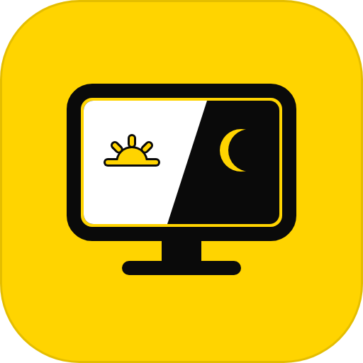

  

<h1 align="center">Better Color Profile</h1>

  <em>Change your screen colors in one click • The modern Windows color profile manager</em>

  
  
  
  

---

**Better Color Profile** is the modern, lightweight display calibration and color profile manager that Windows always needed. 

Built for **Windows 11 and Windows 10**, it completely replaces the clunky, buried Windows Color Management applet (`colorcpl.exe`) with a sleek interface, global hotkeys, and real-time display tuning — allowing you to effortlessly create, customize, and cycle through color profiles with zero lag.

---

## 📦 Installation & Download

Compatible with **Windows 11 and Windows 10** (64-bit and 32-bit):

1. Download [**BetterColorProfileSetup.exe**](https://github.com/KOUKOU221/Better-Color-Profile/releases/latest/download/BetterColorProfileSetup.exe) (Direct download — automatically gets the latest release).
2. Run the setup wizard:
   - Modern installation wizard with custom destination directory selection (automatically creates and installs into a dedicated `BetterColorProfile` folder).
   - Optional Start with Windows and desktop/start-menu shortcuts (enabled by default).
   - Clean uninstallation support via Windows Settings / Installed Apps.

---

## 🛡️ 100% Anti-Cheat Friendly & Gamer Safe

Unlike shader injectors (such as ReShade) or custom overlays that hook into game processes, **Better Color Profile is 100% safe for all competitive online games**:

* **Zero Game Injection**: It never touches, hooks, or inspects game memory, DirectX, Vulkan, or OpenGL pipelines.
* **Official Windows APIs Only**: It interacts exclusively with official Microsoft Windows Color Management (`mscms.dll` / `WcsSetDefaultColorProfile`) and hardware display drivers (`gdi32!SetDeviceGammaRamp`).
* **Approved by Modern Anti-Cheats**: Kernel-level anti-cheat software (including **Riot Vanguard, Easy Anti-Cheat, BattlEye, Ricochet, and VAC**) recognize it as standard Windows display settings.
* **Zero Input Lag & Zero FPS Drop**: Because adjustments are applied at the GPU/monitor hardware LUT level, there is no performance penalty.

---

## 🎮 Why It's a Game-Changer for Gamers & Creators

* **Spot Enemies in Dark Corners**: Boost shadow visibility and contrast in competitive shooters (*CS2, Valorant, Apex Legends, Warzone, Escape from Tarkov*) without washing out bright areas.
* **Custom Digital Vibrance & Color Temperature**: Give your display punchy colors, vibrant highlights, or a warm eye-friendly night tint per game.
* **Customizable Hotkey Switching**: Switch instantly between your high-visibility gaming profile and accurate sRGB desktop profile without Alt-Tabbing or closing your game. Bind any key or combination you prefer.
* **Color Accuracy for Creators**: Switch back to true, calibrated sRGB for Photoshop, Premiere, or web browsing in a single click.

---

## 🚀 Key Features

### 1. ⚡ Instant Profile Application & Sidebar Slots
* **One-Click Apply**: Preview profiles in your sidebar without interrupting your display until you click the prominent **Apply** button.
* **Slot Management**: Organize your favorite profiles into custom slots (Slot 1, Slot 2, Slot 3...).
* **Protected Default Profile**: Your default Windows sRGB color profile is protected in a hidden internal directory (`.internal\`) — impossible to delete or corrupt accidentally.
* **Ghost Profile Cleanup**: Automatically synchronizes with installed Windows profiles and unregisters orphaned or deleted display associations from Windows Color Management.

### 2. 🎛️ 7-Slider Real-Time Display Tuner
* **Fine-Grained Hardware Calibration**:
  - Master Brightness (-100% to +100%)
  - Master Contrast (-100% to +100%)
  - Color Temperature (Warm to Cool)
  - Color Balance: Red, Green, and Blue fine-tuning
  - Gamma Curve adjustment
* **Automatic Sequential Naming**: Creating a new profile? If no name is provided, names are automatically pre-filled sequentially (`Profile 1`, `Profile 2`, etc.).
* **Instant ICC Generation**: Saves calibrated profiles directly into the `list\` directory and auto-associates them with your primary monitor.

### 3. ⌨️ Global & Per-Slot Hotkeys
* **Direct Per-Slot Shortcuts**: Assign an individual shortcut to any profile slot (e.g. `Ctrl + 1`, `F1`, or any custom key combination) to jump directly to that profile without cycling.
* **Cycle Shortcut**: Press your cycle shortcut anywhere to sequentially cycle through all configured profile slots:
  $$\text{Slot 1} \;\longrightarrow\; \text{Slot 2} \;\longrightarrow\; \text{Slot 3} \;\longrightarrow\; \text{...} \;\longrightarrow\; \text{Slot 1}$$
* Fully customizable hotkey bindings in the Profiles tab (supports single keys and custom combinations with zero latency).

### 4. 🧰 System Tray & Background Daemon
* Minimizing or closing the window sends it directly to the system tray so the hotkey remains active.
* Right-click tray menu provides quick slot switching, status overview, and settings.
* Enable **Start with Windows** to keep your preferred profiles ready on startup.

---

## 📄 License & Copyright
Copyright © 2026 KOUKOU221. All rights reserved.

This software and associated documentation files are proprietary. Unauthorized copying, distribution, modification, reverse engineering, or commercial use of this software, in source or binary form, is strictly prohibited without explicit written permission from the copyright owner.

